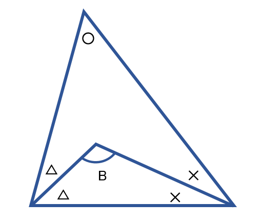

# A問題: たつきくんの算数

実行制限時間: 5 sec / メモリ制限: 512 MB / 配点: 100点

## 問題文

たつきくんは算数の問題を解いています。
しかし、全然解けないというので、はるのちゃんは簡単に解けるプログラムを作ってあげることにしました。

その問題は、以下の通りです。

下記の図のような図形がある場合に、〇の角度がA度であると与えられた場合のBの角度を求めなさい。



## 制約

- 0 < A < 180

---

## 入力

入力は以下の形式で標準入力から与えられる。

```
A
```

## 出力

Bの角度を求めて整数で出力せよ。

なお、Bが整数になることは保証されている。

---

## 入力例1

60

## 出力例1

120

---

## 入力例2

30

## 出力例2

105

---

## 入力例3

90

## 出力例3

135

